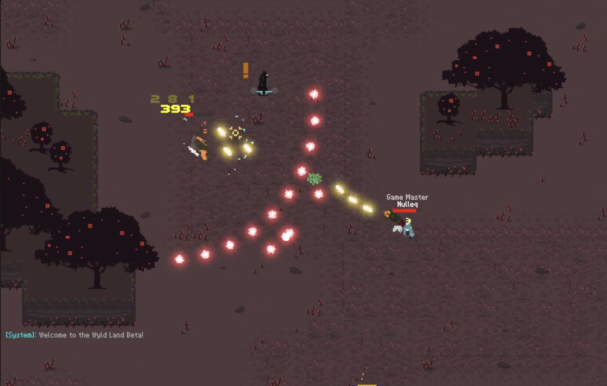

# Wyld Land — Community Edition

**Wyld Land** is a bullet hell MMORPG inspired by games like Realm of the Mad God and Enter the Gungeon and developed by Bag of Holding, Inc. Development ended in 2026, before the game was officially released out of Beta. However, we think it's important, when possible, for games to have a life after their official support ends. In that spirit, we're releasing the Community Edition of Wyld Land.



This is the same game that was available to play during the pre-release Beta Tests. You can easily play it on your local machine, and it's also possible (with some effort and technical know-how) to host a server that your friends can play on as well (i.e., to run a private server of the game).

Note that this is a release that is free as in beer: this means you can download it, play it, modify the game data files, host a server for others, etc. But the game is not being released as open source, so the copyright to the assets still belong to their original owners. For example, you would not legally be able to decompile the built binaries to extract the art assets and use them in a different game.

As this game is no longer supported, it is being provided for free with no support or warranty. See the LICENSE file for complete details.

---

## Play

1. Download this repo (you can click on green "Code" button in the top-right and hit "Download Zip").
2. **macOS** — double-click **`start.command`**
   **Windows** — double-click **`start.bat`**
   **Linux** — run **`./start.sh`**
3. **Note:** You may get warnings (for example on Windows, it will say it is by an unknown publisher, and wants to access devices on your network), this is normal. This is an unsigned binary so Windows and Mac will complain.
4. Your browser opens to the game. Click **"Login"**, enter a **name** and **password** (you can choose anything), and play.
5. To stop: close the launcher window (macOS/Linux: `Ctrl+C` in the terminal; Windows: close the two popup windows).

**Mac First Time Launch**: You will have to manually allow the game to run because it is an unsigned binary. Video Walkthrough: https://youtu.be/8bRTLs14UBo

## Accounts & saves

- A **name is your character.** A new name creates a new character.
- Your **password encrypts that character's save file.** Names are case-insensitive
  (`Nulleq` and `nulleq` are the same account), but your capitalization is kept for
  the in-game name.
- **There is no password recovery.** If you forget it, that character can't be opened
  again. Please, don't reuse a password from something else.
- Saves live in the **`saves/`** folder. Back up that folder to keep your
  characters; delete a file there to remove a character.

## Modding

There is support for modding the game to extend it, change things about the existing content, etc.

All game content lives in **`server/GameData/datafiles/`** as `.tengo` text files —
guns, enemies, bosses, loot tables, auras, achievements, and more. Edit them and
restart the server to see your changes.

- Content that **reuses existing art and sounds** works (new stats, new bullet
  patterns, new enemy behavior, new loot, reskins).
- **Brand-new art or audio is not possible** — the client is a compiled build and its
  assets are fixed.

### Boss Editor

A boss-authoring / playtest sandbox is included for modders. With the game running,
open **`http://localhost:3000/editor.html`** and click **"Login as Guest"**. It drops
you into an Arena where boss definitions can be playtested in isolation.

## Playing with friends

Others on your **local network** (same Wi-Fi/LAN) can join your game — each person gets
their own name + password and their own character:

1. Start the game on your machine (you're the host).
2. Find your machine's local IP address, e.g. `192.168.1.100`.
   (macOS: System Settings → Wi-Fi → Details; Windows: run `ipconfig`; Linux: `ip addr`.)
3. Friends open **`http://<your-ip>:3000/dev.html`** in their browser and log in.
4. Make sure your firewall allows incoming connections on ports **3000** and **2054**.

**Security note:** on a local network, names/passwords are sent **unencrypted** over the
wire — fine for a trusted home network, not for the public internet. Hosting the server
safely over the **internet** additionally needs real TLS certificates (see DEPLOYMENT.md for details).


## Admin / GM (optional)

To give yourself GM powers (admin commands), open the launcher script in a text editor
and set the `ADMIN` line to your name, e.g. `ADMIN="Nulleq"`, then start the game and
log in with that name. Everyone else stays a normal player.

Once you're a GM, type these into the in-game **chat**:

**Yourself**
- `/toggleinvuln` — toggle invulnerability
- `/toggleinvis` — toggle invisibility to enemies
- `/levelup` — play the level-up effect
- `/clearinv` — empty your inventory
- `/clearechoes` — reset your Echo (skill-tree) nodes
- `/setechopoints <n>` — set your banked Echo points
- `/clearcollections` — reset your unlocked collections

**Items**
- `/giveitem <itemId> [tier]` — give an item (optionally rolled at a tier)
- `/givestack <itemId> [count]` — give multiple of one item
- `/givekit [10|13|15]` — give a preset gear kit for that level
- `/giverecipe <recipe name>` — give a recipe's ingredients
- `/addaura <aura name>` — apply an aura to yourself

**Spawning & combat**
- `/spawn <mob name> [level] [cursed]` — spawn a monster (`cursed` = `true`/`false`)
- `/spawndungeon <dungeon name|random> [level]` — spawn a dungeon entrance (a level above 10 adds corruption)
- `/spawnevent <event name>` — start a world event where you stand
- `/spawnshard <level> <dungeon name>` — give a dungeon shard
- `/killnearby` — kill nearby enemies
- `/killall` — kill all non-boss monsters in the zone
- `/damagenearby <amount>` — damage nearby entities
- `/scalemobs [level]` — set every monster's level (default 10)

**Teleport**
- `/teleport <x> <y>` — teleport to coordinates
- `/goto <prefab name>` — teleport to a named object/entity

**World & progress**
- `/pvar <flag> <true|false>` — set a quest flag
- `/pvarlist` — list your quest flags
- `/resetpvars` — clear all your quest flags
- `/zvar <name> <true|false|number>` — set a zone-wide variable
- `/weeklykill <mob name>` — add a mob to your weekly kills
- `/clearlockout` — clear your weekly dungeon lockouts

**Admin**
- `/broadcast <message>` — send a system message to everyone (and force a save)
- `/clone <characterId> [player name]` — copy a character's inventory onto a player (defaults to you)
- `/menu [echoes]` — open a menu (e.g. the Echoes screen)

## What's in here

```
client/      The browser game + boss editor (opened by the launcher, not directly).
server/      The game server and all game content (GameData/).
wyld-local/  A small helper that serves the client and handles local login + saves.
saves/       Your local (encrypted) save files — created on first play.
secret.key   A unique key for this install — created on first launch. Keep it private.
start.*      Launchers for macOS / Linux / Windows.
```

## Troubleshooting

- **"Port already in use"** — a previous launch (or another program) is still using
  port `3000` or `2054`. Close it, or close the old launcher window, and try again.
- **Login screen looks wrong / won't load** — hard-refresh the browser
  (`Cmd/Ctrl + Shift + R`); an old cached copy may be loaded.
- **Nothing opens in the browser** — go to **`http://localhost:3000/dev.html`** manually.
